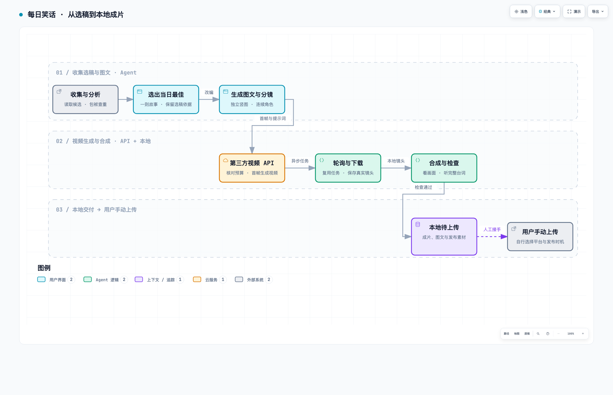

# 每日笑话 · jokes · v0.5.0

一个可分享、可复刻的 Agent Skill：从公开库与圈层素材中精选每日 10 个短篇节目，另写 1 篇脱口秀长稿。支持原神、钓鱼、程序员、相声、苏联政治笑话及英式官僚讽刺。需要制作时，只选最佳短篇生成图文分镜和视频，成片保存本地，等用户自己上传。

现行版本为 v0.5.0，新增首次用途选择、分路执行和跨工具交接，并包含 10+1 与圈层素材扩容。见[更新说明](docs/releases-v0.5.0.md)。

## 下载之前：你想怎样使用？

| 选择 | 你会得到什么 | 从哪里开始 |
| --- | --- | --- |
| A · 只看每日笑话 | 随时点播，默认 10 个短篇 + 1 篇脱口秀；想要定时推送时再设置，不需要视频密钥 | [阅读路线](docs/getting-started.md#路线-a只看每日笑话) |
| B · 制作图文和视频 | 从短篇中选最佳一则，文生图、图生视频，成片本地保存等你上传；也可只做其中一步 | [生产路线](docs/getting-started.md#路线-b把笑话做成图文和视频) |

**两个选择使用同一份 Skill，不需要下载两套。** [下载 v0.5.0 安装包](https://github.com/wekobear/daily-jokes/releases/download/v0.5.0/jokes.zip)。安装后首次调用，Agent 会在用途未知时只问这一题；你已经说清要文字或视频，就直接执行，不再重复问。下载文件本身不会弹窗或启动生成。

可以一直只看笑话，也可以随时说“今天只看”“把第二则做成视频”“换个工具继续”。[切换与换工具方法](docs/getting-started.md#随时切换路线或换工具)会保留已有内容，不要求重新从头做。

## 版本命名

采用 `年度序号.功能版本.小更新`，以 [VERSION](VERSION) 为现行版本来源。2026 年年度位为 `0`，2027 年为 `1`，依次递增；不是永久使用 `0` 前缀。

- 当前版本 `0.5.0`：2026 年、功能版本 5、小更新 0。
- 同年小修为 `0.5.1`；功能更新为 `0.6.0`，小更新位归零。
- 跨年后的首次更新为 `1.0.0`，后两位归零；没有更新时不自动发布。同一批未发布修改不按编辑次数加号。

这是年度编号约定，不按标准 SemVer 的破坏性变更划分第一位；兼容性变化另作说明。依赖版本、API／数据结构版本不随项目改号。已经发布的历史版本和下载地址保持原编号，旧验证记录及本地旧包保留用于追溯，不代表现行版本。

“自动化”是具备搜索、生图和执行能力的 Agent 编排生产步骤，不是安装后无需配置就每天运行的独立服务。本项目不接管视频平台账号，不自动上传或发布。

## 每天的 10+1 怎么组成

| 类型 | 默认数量 |
| --- | --- |
| 圈层短笑话，例如原神、钓鱼、程序员、健身、养宠 | 6 个 |
| 短相声，每段完整逗哏／捧哏对话算一个 | 2 个 |
| 苏联政治笑话，有可核验的流传来源 | 1 个 |
| 英式官僚讽刺，参考话语机制另写虚构对话 | 1 个 |
| 原创脱口秀长稿，约 1000—1500 汉字 | 另加 1 篇 |

相声与政治讽刺都包含在 10 个名额内，只有长稿另加。比例可调整，明确“只要五则”就给五则，不附长稿。混合题材按天轮换；同一圈子也能用不同形式，不重复计算。

明确排除调侃中国或中国领导人的政治笑话，包括谐音、代称与影射；此要求贯穿候选、相声、长稿、图文和视频。苏联与英式讽刺不改成对中国的政治调侃。

公开库接入与圈层表见[素材说明](references/joke-sources-and-circles.md)，相声、经典对话处理与长稿写法见[表演形式](references/performance-formats.md)。

[多路研究与筛选实例](docs/research-v0.4.0.md)包含 11 个保留方向、来源核验边界及未通过的候选，不直接将所有模型输出当作已审核笑话。

## 生产流程展示

[](docs/workflow.html)

[打开可交互流程图](docs/workflow.html) · [流程图源文件](docs/workflow.json) · [完整生产说明](references/daily-production.md)

图中展示的是 B 路线中的媒体生产，不包含首次选择和 A 阅读分支；完整生产先交付 10 个短篇和 1 篇长稿，再选最佳。A 路线在文字交付后结束，无需进入此图。现有 Archify 图未重新渲染。

流程展示使用 [Archify](https://github.com/tt-a1i/archify) 生成。感谢 tt-a1i 和 Archify 的开源贡献，让这条流程可以用可交互、自包含的 HTML 展示；使用的代码版本、许可证和复现方法见 [第三方致谢](THIRD_PARTY_NOTICES.md)。

GitHub 的 Markdown 页面展示静态预览，不直接运行 HTML；下载 Skill 后在浏览器打开 `docs/workflow.html` 即可交互，无需部署网站。

## 快速使用

[下载 v0.5.0 安装包](https://github.com/wekobear/daily-jokes/releases/download/v0.5.0/jokes.zip) · [新手教程](docs/getting-started.md) · [案例与视频](examples/README.md) · [更换视频服务](references/video-provider-contract.md)

第一次调用可只发 `$jokes 开始使用`，再回答 A 或 B；也可直接说 `$jokes 只看今天的笑话，不做图片和视频`，跳过已经回答的用途问询。

将安装包中的完整 `jokes/` 文件夹放进所用 Agent 的 Skill 目录，通过宿主的技能入口调用。Codex 可使用 `$jokes`。不要只复制 `SKILL.md`；脚本、参考文件和素材需要保持相对位置。

本地源码可以重新打包：

```bash
python3 scripts/package_skill.py
```

安装包仅包含明确清单中的通用文件，不包含私有运行区或配置。v1.3.0 新增通用视频服务流程、新手教程、当日选稿、Archify 流程展示和完整案例资源。v1.2.0 保留供回溯。

打包默认读取 VERSION，当前输出 `dist/v0.5.0/jokes.zip`；新版本自动使用对应版本目录，不覆盖旧包。

向 Agent 发出一次完整制作请求：

```text
$jokes 收集适合普通观众的生活笑话，分析候选并选出当日最佳一则。
生成图文阅读稿、三个独立竖屏分镜，再调用我已配置的视频服务。
若用随包参考脚本，使用 MiniMax H3；其他服务先按官方文档适配。
本次视频 API 总预算 8 元，成片保存本地，等我自己上传，不发布。
```

这段示例是使用者未来执行时的请求，不表示安装 Skill 就授权扣费。也可以先说“只完成图文和分镜，不调用视频 API”，或“复用已有分镜，只做四秒 H3 试片，预算 2 元”。

## 怎么收集、分析和选择

通常先读二十至三十条不同故事的候选，保留实际来源与改编依据。先淘汰逻辑不成立、重复包袱、需要解释或不能合规使用的内容，再按包袱力度、独立易懂、可视化、制作稳定性、新鲜感与受众匹配比较。

先完成 10 个短篇和独立长稿，再从短篇前三名中选出一则最适合目标时长的故事，而不是简单选择热度最高的一条。“当日最佳”仅指本批候选中的编辑判断，不承诺全网最佳。具体评分权重、查重方法和取舍记录见 [每日生产流程](references/daily-production.md)；可复用 [选稿模板](assets/selection-template.md)。

可用 A-Joke 补充候选，无需视频 Key：

```bash
python3 scripts/collect_jokes.py --date 2026-09-13 --count 30 --issues 4 --output runs/2026-09-13/candidates.json
```

换成实际日期与新路径。此命令只获取未审候选，筛选、圈层归类和原创由 Agent 完成。A-Joke 的 MIT 仓库包含网络整理内容，不代表每条段子都是公版；不把整库打进分享包。

## 已有案例

| 案例 | 可直接查看的内容 | 类型 |
| --- | --- | --- |
| [雨伞误会](examples/umbrella/README.md) | 三张分镜、图文稿、静音和中文配音视频 | 叙事预演，不是视频模型动作动画 |
| [因为这儿亮](examples/afanti/README.md) | 三镜完整故事与十五秒配音样片 | 本地 FFmpeg 图文视频 |
| [路灯下的老人](examples/h3-trial/README.md) | 首帧、完整提示词和约四秒视频 | 真实 MiniMax H3 单镜试片 |

案例视频也作为 Release 附件提供，下载后可直接播放，无需重新付费生成。

## 图文怎样变成视频

同一个笑话先写精简正文，再拆成建立场景、形成预期、结尾揭底等节拍。用具体的角色外形、服装和道具设定生成独立竖图，逐张检查连续性。图文阅读稿复用这些图片，视频则每镜使用对应首帧和运动提示词。

每镜视频提示词包含时序动作、说话者、完整台词和停顿。不会把整张漫画拼格直接当成独立镜头，也不会用图片预演冒充第三方人物动作视频。实际原生台词是否正确，需要检查成片，不能只看接口成功。

## 环境与自己的 API Key

本节只适用于制作路线；只读笑话无需安装媒体依赖、配置视频 Key 或购买视频服务。文字使用当前 Agent 能力，联网收集依赖实际搜索工具；运行可选的 A-Joke 导入脚本才需要 Python。

完整媒体生产需要有联网和图片生成能力的 Agent，以及 Python 3.11+、Pillow、FFmpeg、ffprobe 和中文字体。第三方视频脚本支持 macOS/Linux；本地系统配音另需 macOS 的中文音色。Windows 原生运行尚未验证。

在 Skill 根目录准备环境：

```bash
python3 -m venv .venv
.venv/bin/python -m pip install -r requirements.txt
source .venv/bin/activate
python3 scripts/pipeline.py doctor
```

使用者自行在本地私有环境文件填写 `MINIMAX_API_KEY`，模板为 [.env.example](.env.example)。公开 API 地址和配置字段名可以分享，真实密钥不能进入聊天、源码、截图、日志或安装包。无需任何社交平台 Cookie、密码或账号配置。

流程可以更换视频 API，选稿、图文分镜和本地交付保持不变，变化集中在服务接入层；详见 [通用替换约定](references/video-provider-contract.md)。本包已实现 MiniMax 中国区 H3 参考适配，其他供应商需要各自适配，不是只改 URL。当前价格、模型差异和安全续跑方法见 [MiniMax 接入](references/minimax-api.md)。

## 执行命令与结果

选稿、生图由 Agent 执行；随后按 [视频流程](references/video-workflow.md)使用下列已有命令：

```text
doctor → init → image（逐镜）→ estimate → generate（提交／续跑）
→ assemble → 实际查看与听取 → review → upload-package
```

先看估算，再按使用者本次预算提交。`generate` 退出码 75 表示仍在处理，查询已有任务即可，不重复创建。缺密钥、余额或必要授权时保留已完成的文案和图片，不捏造视频结果。

完整生产路线的交付包含以下文件；阅读路线只展示所需文字，不强制创建媒体目录：

- `daily-jokes.md` 与 `standup.md`：10 个短篇与另附长稿，明确只制作一则时按请求省略。
- `selection.md`：候选分析、来源和最佳选择依据。
- `graphic-story.md` 与 `images/`：可读图文及独立分镜。
- `videos/`：下载到本地的第三方视频镜头。
- `output/final.mp4`、`final.srt`、`cover.jpg`：合成成片、字幕与封面。
- `upload-package.zip`：视频、封面、字幕、发布文案及待上传清单。

选稿和图文文档由 Agent 写入，脚本不自动联网生成它们。私有 `state.json` 记录续跑任务，不纳入分享包。最终状态是“已保存本地、等待用户上传”，不是后台草稿或公开发布。

## 本地视频：无需视频 API

仍保留已有的本地路线：GPT 分镜 → macOS 中文配音 → FFmpeg 轻微镜头推进与逐句字幕 → MP4。这是配音图文视频，不是模型生成的人物动作动画。

可用随包的已公开样例复现，不必再次生图：

```bash
python3 scripts/pipeline.py init --story examples/afanti/story.json --run runs/afanti-local
python3 scripts/pipeline.py image --run runs/afanti-local --shot s1 --file examples/afanti/images/s1.png
python3 scripts/pipeline.py image --run runs/afanti-local --shot s2 --file examples/afanti/images/s2.png
python3 scripts/pipeline.py image --run runs/afanti-local --shot s3 --file examples/afanti/images/s3.png
python3 scripts/local_video.py --run runs/afanti-local
```

成片为 `runs/afanti-local/local-video/local_video.mp4`。示例使用 Tingting、Grandpa、Reed 中文系统音色，缺少时自行安装或在初始化前换为本机可用音色。新内容另建目录，不覆盖旧成片。

[十五秒本地样片](examples/afanti/demo.mp4) · [公开示例分镜与文案](examples/afanti/story.json)

## 其他调用

```text
$jokes 来五个生活笑话，温和，不加入自嘲。
$jokes 把刚才第二个笑话画成一张漫画。
$jokes 把这则笑话做成本地配音视频，不调用视频 API。
$jokes 继续上次运行，先检查已有状态，不重复付费提交。
```

支持指定数量文字和逐则漫画；默认日报为 10+1，当日最佳视频仍只做一则。偏好和历史仅保存在使用者允许的私有位置，不装入通用 Skill。

## 验证与分享

[验证记录](tests/verification.md)区分历史实跑、本次离线测试与尚未验证的能力。真实 H3 四秒单镜头生成、下载及媒体检查已跑通；这不等于三镜完整 H3 成片或任何平台上传已经跑通。

```bash
python3 -m unittest discover -s tests -p 'test_*.py' -v
python3 scripts/package_skill.py
```

分享安装包，不直接压缩工作目录。不包含真实 Key、Cookie、私人账号、绝对路径、对话记录或 `runs/`；公开示例与生成样片是明确选入的教学素材，不是使用者的私人产物。字体、系统音色和外部工具不随包分发。

## 开源依赖与致谢

- [Licoy/A-Joke](https://github.com/Licoy/A-Joke)：历史笑话候选库，感谢 Licoy 的整理；固定版本、来源边界和导入说明见素材文档。
- [Archify](https://github.com/tt-a1i/archify)：生产流程图的生成、交互展示与验证，MIT 许可证。谢谢这个项目让流程说明更直观。
- [FFmpeg](https://ffmpeg.org/)：视频拼接、编码、音轨、字幕和媒体检查；H.264 编码依赖所用构建的 x264 支持。
- [Pillow](https://python-pillow.org/)：图像检查与字幕排版。
- [Python](https://www.python.org/)：流程、状态和任务管理。

GPT 生图、MiniMax API 与 macOS 系统音色是外部或系统能力，不列作本项目开源依赖。Archify 的许可证与字体声明见 [第三方致谢](THIRD_PARTY_NOTICES.md)。
