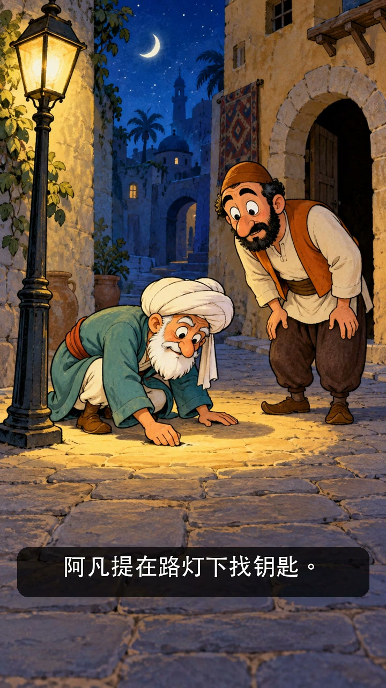
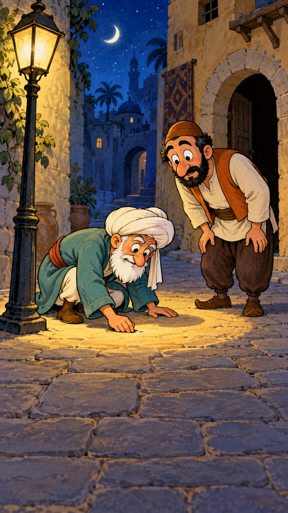

# 因为这儿亮：十五秒本地配音图文视频

老人蹲在路灯下找钥匙。路人问：“掉这儿了？”老人说：“没有，掉屋里了。”路人疑惑：“那你为什么在这儿找？”老人指着路灯：“因为这儿亮！”

包袱是目标与手段的倒置：本该在丢失处寻找，却因为照明更好而换地方。关键是最后才揭示老人的理由，而不是在封面上提前解释。

[播放十五秒样片](demo.mp4) · [完整台词与分镜输入](story.json)

## 图文分镜

老人蹲在路灯下找钥匙，路人前来询问。

老人承认钥匙掉在屋里。路人开始困惑。

“那你为什么在这儿找？”“因为这儿亮！”

## 已经做到了什么

三个 GPT 独立分镜，macOS 中文角色配音，FFmpeg 轻微镜头推进、逐句字幕、封面和十五秒 MP4。没有调用视频生成 API，也没有人物口型或肢体动画；渲染无需视频 Key。

[README 的本地命令](../../README.md#本地视频无需视频-api)可以直接复刻。需要 macOS 对应中文音色；缺少时换为本机可用音色，并在初始化前修改输入。不同故事或改动版本另建运行目录。

来源：[DLTK — The Lamp and the Key](https://www.dltk-kids.com/ya/nasruddin/lamp-key/story.htm)，本案例作了简短中文改编。与 [H3 单镜试片](../h3-trial/README.md)使用同一故事，但两种视频的制作方式不同。
